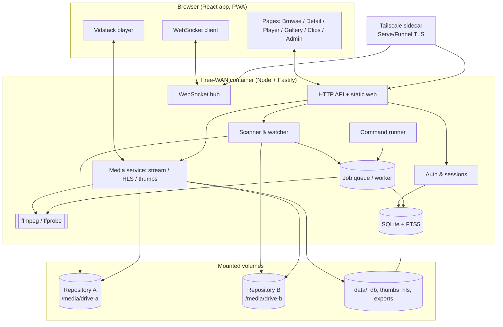
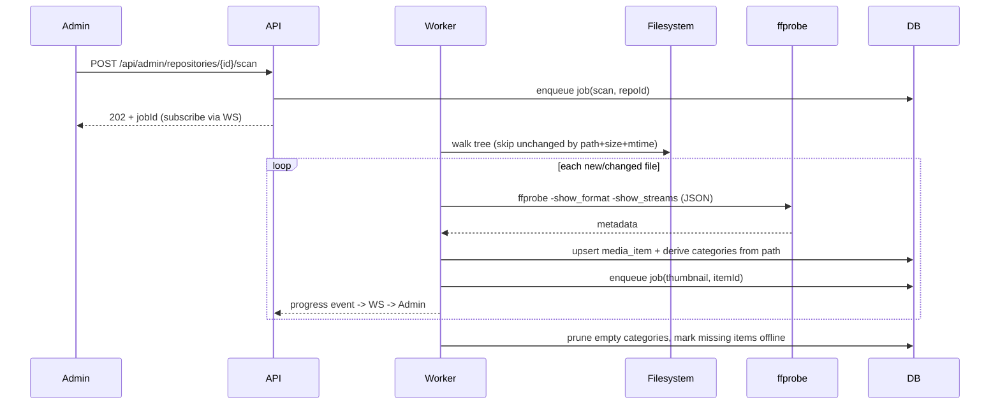
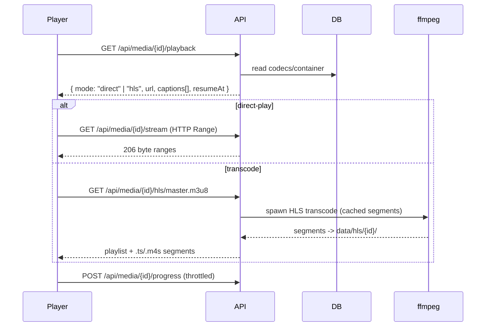
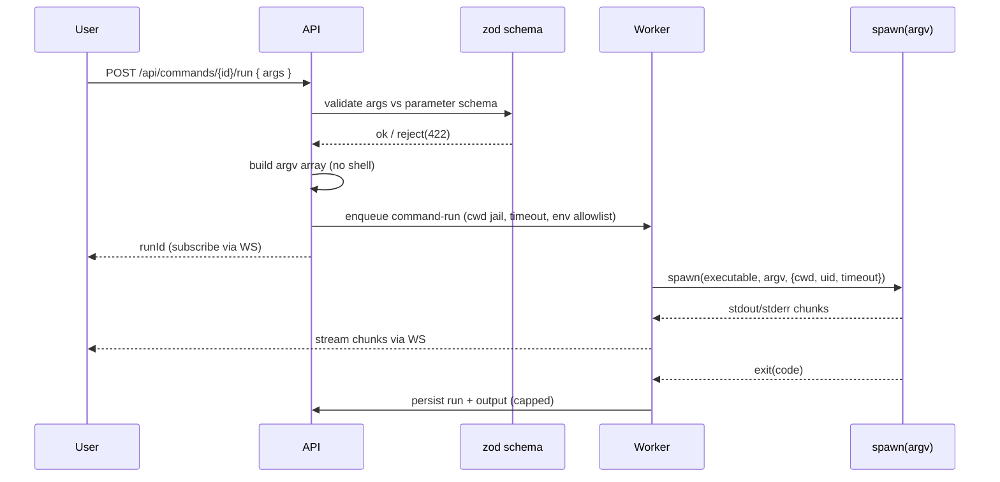

# 02 — Architecture

## 1. Tech stack & rationale

| Layer | Choice | Why |
|-------|--------|-----|
| Language | TypeScript everywhere | One language, shared types between client and server, agent-friendly. |
| Frontend | React 18 + Vite | Fast dev/build, huge ecosystem, first-class with the player and Tailwind. |
| Routing | React Router | URL-driven views (FR-22). |
| Server state | TanStack Query | Caching, background refetch, pagination for big libraries (NFR-01). |
| UI state | Zustand | Tiny store for player/gallery/theme state. |
| Styling | Tailwind CSS + CSS variables | Utility speed *and* runtime theming for branding (FR-45–48). |
| Player | Vidstack (`@vidstack/react`) | Modern, accessible, small (~53 kB gz), native HLS/DASH, captions, speed, scrubbing. |
| Backend | Node.js 20+ + Fastify | High-throughput HTTP, native streams (ideal for ranged media + HLS), schema validation, WebSocket support. |
| Validation | zod | Single source of truth for request/entity shapes, shared with the client. |
| ORM/DB | Drizzle ORM on better-sqlite3 (SQLite) | Embedded, zero-ops, transactional; Drizzle is typed and migration-friendly; FTS5 for search. |
| Media | `ffmpeg` + `ffprobe` via `child_process.spawn` | Industry standard; called directly with argv arrays (no `fluent-ffmpeg`, which was archived May 2025). |
| Jobs | In-process worker + `jobs` table | Scans, transcodes, thumbnails, exports without Redis/BullMQ. |
| Auth | Argon2id password hashing + signed httpOnly session cookies (JWT or opaque) | Standard, memory-hard, works behind Tailscale TLS. |
| Realtime | WebSocket (Fastify `@fastify/websocket`) | Live scan progress and command output (FR-14, FR-53). |
| Packaging | Docker + Docker Compose | One-command, cross-platform deploy (NFR-04). |
| Remote access | Tailscale sidecar + Serve/Funnel | Private HTTPS from anywhere, no port-forwarding. |

> **Library currency note (mid-2026):** Vidstack and Video.js are both actively maintained;
> Vidstack is the smaller, more modern default. `fluent-ffmpeg` is **archived/deprecated** —
> drive ffmpeg directly. Pin all versions in the lockfile and record them in an ADR.

## 2. Component overview



## 3. Runtime processes

A single Node process hosts the API, the static frontend, the WebSocket hub, and an
in-process worker. This keeps deployment to one container plus the Tailscale sidecar.

- **HTTP/API + static**: Fastify serves the built React app and the JSON API under
  `/api`, and streams media under `/api/media/...`.
- **WebSocket hub**: pushes `scan`, `job`, and `command-run` events to subscribed clients.
- **Worker**: a single async consumer of the `jobs` table running one job per slot, with a
  small configurable concurrency (e.g. 2 transcodes, N thumbnailing). Long work
  (`scan`, `transcode-segment`, `thumbnail`, `clip-export`) is a job; quick reads are
  synchronous. Using `worker_threads` for CPU-bound orchestration is allowed, but ffmpeg
  itself runs as a child process so the event loop stays free.

If transcode load ever needs isolation, the worker can be split into a second container
sharing the same volumes and DB — the design permits it, v1 does not require it.

## 4. Key data flows

### 4.1 Scan & categorize (FR-06–FR-15)



Category derivation: split the file path relative to the repository root; each segment is
a category node keyed by `(repository_id, parent_id, name)`; the item is linked to every
node along the chain. See [`06-media-pipeline.md`](06-media-pipeline.md) §4.

### 4.2 Playback (FR-23–FR-30)



Decisioning (`mode`) is computed from the probed video codec, audio codec, and container
against a browser-capability matrix; details in
[`07-feature-video-playback.md`](07-feature-video-playback.md) §3.

### 4.3 Command run (FR-49–FR-57)



Security details (no-shell rule, cwd jail, limits, privilege) are normative in
[`13-security.md`](13-security.md).

## 5. Configuration sources

Resolved at boot, in increasing precedence: built-in defaults → `config/free-wan.yaml`
→ environment variables → values stored in the DB `settings` table (admin-editable at
runtime). Repositories may be seeded from `config/repositories.yaml` and thereafter
managed in the DB. See [`12-deployment.md`](12-deployment.md) §4.

## 6. Directory layout

See [`AGENTS.md`](../AGENTS.md) "Repository layout". Runtime data lives under a single
mounted `data/` volume:

```
data/
├── free-wan.db           # SQLite (index, users, likes, collections, clips, branding, commands, runs)
├── thumbs/               # poster + sprite images (regenerable)
├── hls/                  # transcode segment cache (LRU-evicted, regenerable)
├── exports/              # clip exports (user-visible output)
└── branding/             # uploaded logo/favicon/fonts
```

## 7. Why these boundaries

- **Single SQLite DB** for everything stateful keeps backup trivial (copy one file) and
  matches a single-instance, self-hosted tool (NFR-11).
- **Regenerable caches separated from durable data** so thumbnails/HLS can be wiped and
  rebuilt without risking user data (NFR-11, NFR-12).
- **Media referenced only by `id`** across the API so raw paths never reach the client
  and path-traversal has no surface (NFR-06).
- **One process, one container (+ Tailscale)** to honor the one-command deploy goal while
  leaving a clean seam to scale transcoding out later.
