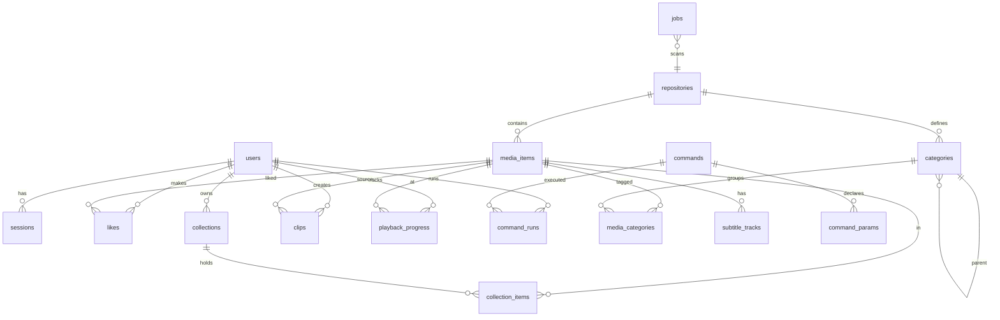

# 03 — Data Model

SQLite via Drizzle ORM (better-sqlite3). The DDL below is the normative schema; implement
it as Drizzle table definitions plus a migration. Conventions: `id` is a UUIDv7 text
primary key unless noted; timestamps are integer epoch-millis; booleans are `0/1`; JSON
is stored as `text` and validated with zod on read/write.

## 1. Entity-relationship overview



## 2. Core tables

```sql
-- Users & auth ---------------------------------------------------------------
CREATE TABLE users (
  id            TEXT PRIMARY KEY,
  username      TEXT NOT NULL UNIQUE,
  password_hash TEXT NOT NULL,              -- argon2id
  role          TEXT NOT NULL CHECK (role IN ('admin','user')),
  can_run_commands INTEGER NOT NULL DEFAULT 0,  -- per-user override (FR-56)
  disabled      INTEGER NOT NULL DEFAULT 0,
  must_change_password INTEGER NOT NULL DEFAULT 0,  -- forced-change flow (added in Phase 1; see ADR 0002)
  created_at    INTEGER NOT NULL,
  updated_at    INTEGER NOT NULL
);

CREATE TABLE sessions (
  id          TEXT PRIMARY KEY,             -- opaque token id (stored in httpOnly cookie)
  user_id     TEXT NOT NULL REFERENCES users(id) ON DELETE CASCADE,
  created_at  INTEGER NOT NULL,
  expires_at  INTEGER NOT NULL,
  user_agent  TEXT,
  revoked     INTEGER NOT NULL DEFAULT 0
);
CREATE INDEX idx_sessions_user ON sessions(user_id);

-- Repositories ---------------------------------------------------------------
CREATE TABLE repositories (
  id          TEXT PRIMARY KEY,
  name        TEXT NOT NULL,
  root_path   TEXT NOT NULL,                -- absolute path inside the container
  type        TEXT NOT NULL CHECK (type IN ('video','image','mixed')),
  enabled     INTEGER NOT NULL DEFAULT 1,
  read_only   INTEGER NOT NULL DEFAULT 1,
  status      TEXT NOT NULL DEFAULT 'unknown'
                CHECK (status IN ('unknown','online','offline','scanning','error')),
  last_scan_at INTEGER,
  last_error  TEXT,
  created_at  INTEGER NOT NULL,
  updated_at  INTEGER NOT NULL
);

-- Media items ----------------------------------------------------------------
CREATE TABLE media_items (
  id            TEXT PRIMARY KEY,
  repository_id TEXT NOT NULL REFERENCES repositories(id) ON DELETE CASCADE,
  rel_path      TEXT NOT NULL,              -- path relative to repository root
  type          TEXT NOT NULL CHECK (type IN ('video','image')),
  title         TEXT NOT NULL,              -- derived from filename, editable later
  ext           TEXT NOT NULL,
  size_bytes    INTEGER NOT NULL,
  file_mtime    INTEGER NOT NULL,           -- for incremental scan (FR-12)
  content_hash  TEXT,                       -- optional, for move/dedupe detection
  -- media metadata (FR-07/08) -------------------------------------------------
  duration_s    REAL,                       -- video only
  width         INTEGER,
  height        INTEGER,
  frame_rate    REAL,
  bitrate       INTEGER,
  container     TEXT,
  video_codec   TEXT,
  audio_codec   TEXT,
  audio_tracks  INTEGER DEFAULT 0,
  has_embedded_subs INTEGER NOT NULL DEFAULT 0,
  captured_at   INTEGER,                    -- EXIF/creation time when known
  orientation   INTEGER,                    -- EXIF orientation for images
  -- derived assets ------------------------------------------------------------
  poster_path   TEXT,                       -- data/thumbs/...
  sprite_path   TEXT,                       -- scrub sprite sheet (video)
  -- playback decisioning cache ------------------------------------------------
  playback_mode TEXT CHECK (playback_mode IN ('direct','hls')),
  -- lifecycle -----------------------------------------------------------------
  status        TEXT NOT NULL DEFAULT 'active'
                  CHECK (status IN ('active','offline','missing')),
  added_at      INTEGER NOT NULL,
  updated_at    INTEGER NOT NULL,
  UNIQUE (repository_id, rel_path)
);
CREATE INDEX idx_items_repo     ON media_items(repository_id);
CREATE INDEX idx_items_type     ON media_items(type);
CREATE INDEX idx_items_added    ON media_items(added_at);
CREATE INDEX idx_items_duration ON media_items(duration_s);
CREATE INDEX idx_items_status   ON media_items(status);

-- Categories (auto from folders, FR-10/11) -----------------------------------
CREATE TABLE categories (
  id            TEXT PRIMARY KEY,
  repository_id TEXT NOT NULL REFERENCES repositories(id) ON DELETE CASCADE,
  parent_id     TEXT REFERENCES categories(id) ON DELETE CASCADE,
  name          TEXT NOT NULL,              -- single folder segment
  path          TEXT NOT NULL,              -- full slash-joined path from repo root
  depth         INTEGER NOT NULL,
  item_count    INTEGER NOT NULL DEFAULT 0, -- maintained on scan for fast facets
  UNIQUE (repository_id, path)
);
CREATE INDEX idx_categories_parent ON categories(parent_id);

-- item <-> every ancestor category along its path (enables nested filtering)
CREATE TABLE media_categories (
  media_item_id TEXT NOT NULL REFERENCES media_items(id) ON DELETE CASCADE,
  category_id   TEXT NOT NULL REFERENCES categories(id) ON DELETE CASCADE,
  is_leaf       INTEGER NOT NULL DEFAULT 0, -- 1 for the deepest (its own folder)
  PRIMARY KEY (media_item_id, category_id)
);
CREATE INDEX idx_mediacat_cat ON media_categories(category_id);

-- Subtitle tracks (FR-15, FR-26) ---------------------------------------------
CREATE TABLE subtitle_tracks (
  id            TEXT PRIMARY KEY,
  media_item_id TEXT NOT NULL REFERENCES media_items(id) ON DELETE CASCADE,
  kind          TEXT NOT NULL CHECK (kind IN ('embedded','sidecar')),
  language      TEXT,                       -- BCP-47 when known
  label         TEXT,
  format        TEXT,                       -- srt, vtt, ass, mov_text, subrip…
  stream_index  INTEGER,                    -- embedded only
  rel_path      TEXT                        -- sidecar only
);
CREATE INDEX idx_subs_item ON subtitle_tracks(media_item_id);
```

## 3. User content tables

```sql
-- Likes (FR-31/34) -----------------------------------------------------------
CREATE TABLE likes (
  user_id       TEXT NOT NULL REFERENCES users(id) ON DELETE CASCADE,
  media_item_id TEXT NOT NULL REFERENCES media_items(id) ON DELETE CASCADE,
  created_at    INTEGER NOT NULL,
  PRIMARY KEY (user_id, media_item_id)
);
CREATE INDEX idx_likes_item ON likes(media_item_id);   -- popularity counts

-- Collections (FR-33) --------------------------------------------------------
CREATE TABLE collections (
  id            TEXT PRIMARY KEY,
  user_id       TEXT NOT NULL REFERENCES users(id) ON DELETE CASCADE,
  name          TEXT NOT NULL,
  description   TEXT,
  cover_item_id TEXT REFERENCES media_items(id) ON DELETE SET NULL,
  created_at    INTEGER NOT NULL,
  updated_at    INTEGER NOT NULL
);
CREATE TABLE collection_items (
  collection_id TEXT NOT NULL REFERENCES collections(id) ON DELETE CASCADE,
  media_item_id TEXT NOT NULL REFERENCES media_items(id) ON DELETE CASCADE,
  position      INTEGER NOT NULL,
  added_at      INTEGER NOT NULL,
  PRIMARY KEY (collection_id, media_item_id)
);

-- Clips (FR-40–44) -----------------------------------------------------------
CREATE TABLE clips (
  id             TEXT PRIMARY KEY,
  user_id        TEXT NOT NULL REFERENCES users(id) ON DELETE CASCADE,
  source_item_id TEXT REFERENCES media_items(id) ON DELETE SET NULL,  -- null => orphaned
  name           TEXT NOT NULL,
  start_s        REAL NOT NULL,
  end_s          REAL NOT NULL,
  loop           INTEGER NOT NULL DEFAULT 1,
  poster_path    TEXT,
  export_path    TEXT,                       -- set when exported (FR-43)
  export_status  TEXT CHECK (export_status IN ('none','queued','rendering','ready','failed'))
                   DEFAULT 'none',
  created_at     INTEGER NOT NULL,
  updated_at     INTEGER NOT NULL,
  CHECK (end_s > start_s)
);
CREATE INDEX idx_clips_user ON clips(user_id);

-- Resume / watched state (FR-27) ---------------------------------------------
CREATE TABLE playback_progress (
  user_id       TEXT NOT NULL REFERENCES users(id) ON DELETE CASCADE,
  media_item_id TEXT NOT NULL REFERENCES media_items(id) ON DELETE CASCADE,
  position_s    REAL NOT NULL,
  duration_s    REAL,
  watched       INTEGER NOT NULL DEFAULT 0,
  updated_at    INTEGER NOT NULL,
  PRIMARY KEY (user_id, media_item_id)
);
```

## 4. Settings, branding, commands, jobs

```sql
-- Key/value settings incl. branding (FR-45–48) -------------------------------
CREATE TABLE settings (
  key        TEXT PRIMARY KEY,   -- e.g. 'branding', 'scan', 'transcode'
  value      TEXT NOT NULL,      -- JSON blob validated by a zod schema per key
  updated_at INTEGER NOT NULL
);
-- branding JSON shape: { siteName, logoPath, faviconPath, theme, mode,
--   colors:{primary,accent,background,surface,text}, fontHeading, fontBody }

-- Custom commands (FR-49–57) -------------------------------------------------
CREATE TABLE commands (
  id              TEXT PRIMARY KEY,
  name            TEXT NOT NULL,
  description     TEXT,
  executable      TEXT NOT NULL,            -- absolute path or allowlisted binary name
  arg_template    TEXT NOT NULL,            -- JSON array of tokens (see §5)
  working_dir     TEXT,                     -- must resolve within an allowed root
  timeout_s       INTEGER NOT NULL DEFAULT 600,
  max_output_kb   INTEGER NOT NULL DEFAULT 1024,
  env_allowlist   TEXT NOT NULL DEFAULT '[]',  -- JSON array of env var names to pass
  allow_non_admin INTEGER NOT NULL DEFAULT 0, -- FR-56
  enabled         INTEGER NOT NULL DEFAULT 1,
  is_internal     INTEGER NOT NULL DEFAULT 0, -- built-ins like "Rescan" (FR-57)
  created_by      TEXT REFERENCES users(id) ON DELETE SET NULL,
  created_at      INTEGER NOT NULL,
  updated_at      INTEGER NOT NULL
);

CREATE TABLE command_params (
  id           TEXT PRIMARY KEY,
  command_id   TEXT NOT NULL REFERENCES commands(id) ON DELETE CASCADE,
  name         TEXT NOT NULL,               -- referenced by arg_template tokens
  label        TEXT NOT NULL,
  type         TEXT NOT NULL CHECK (type IN
                 ('string','number','boolean','enum','repo_path')),
  required     INTEGER NOT NULL DEFAULT 0,
  default_value TEXT,
  constraints  TEXT,                        -- JSON: {min,max,pattern,options[],repoId}
  position     INTEGER NOT NULL,
  UNIQUE (command_id, name)
);

CREATE TABLE command_runs (
  id          TEXT PRIMARY KEY,
  command_id  TEXT NOT NULL REFERENCES commands(id) ON DELETE CASCADE,
  user_id     TEXT REFERENCES users(id) ON DELETE SET NULL,
  args        TEXT NOT NULL,                -- JSON of submitted param values
  resolved_argv TEXT NOT NULL,              -- JSON of the actual argv used (audit)
  status      TEXT NOT NULL CHECK (status IN
                ('queued','running','succeeded','failed','canceled','timeout')),
  exit_code   INTEGER,
  output_path TEXT,                         -- streamed output persisted to file if large
  output_text TEXT,                         -- inline if small
  truncated   INTEGER NOT NULL DEFAULT 0,
  started_at  INTEGER,
  finished_at INTEGER,
  created_at  INTEGER NOT NULL
);
CREATE INDEX idx_runs_cmd  ON command_runs(command_id);
CREATE INDEX idx_runs_user ON command_runs(user_id);

-- Background jobs (scan/thumbnail/transcode/clip-export) ----------------------
CREATE TABLE jobs (
  id          TEXT PRIMARY KEY,
  type        TEXT NOT NULL,                -- scan | thumbnail | transcode | clip_export
  payload     TEXT NOT NULL,               -- JSON
  status      TEXT NOT NULL CHECK (status IN
                ('queued','running','succeeded','failed','canceled')),
  priority    INTEGER NOT NULL DEFAULT 0,
  progress    REAL NOT NULL DEFAULT 0,
  attempts    INTEGER NOT NULL DEFAULT 0,
  error       TEXT,
  created_at  INTEGER NOT NULL,
  started_at  INTEGER,
  finished_at INTEGER
);
CREATE INDEX idx_jobs_status ON jobs(status, priority);
```

## 5. `arg_template` format (command → argv)

`arg_template` is a JSON array; each element is either a **literal** string or a
**parameter reference**. The runner produces a flat argv array by resolving references
against validated, typed values. No element is ever concatenated into a shell string.

```jsonc
// Example: yt-dlp -f "<format>" -o "<dir>/%(title)s.%(ext)s" <url>
[
  "-f", { "param": "format" },
  "-o", { "param": "outputDir", "suffix": "/%(title)s.%(ext)s" },
  { "param": "url" }
]
```

- `boolean` params may use `{ "param": "x", "whenTrue": ["--flag"] }` to emit flags
  conditionally (emitting nothing when false).
- `repo_path` params resolve to an absolute path **only if** it stays within the
  repository named in `constraints.repoId` (validated server-side; see security doc).
- Missing optional params with no default emit nothing.

## 6. Full-text search (FR-17)

```sql
CREATE VIRTUAL TABLE media_fts USING fts5(
  title, filename, categories,
  content='',            -- external-content / contentless; populated by triggers/service
  tokenize = 'unicode61 remove_diacritics 2'
);
```

Populate/refresh `media_fts` whenever a `media_items` row or its category links change
(via the scanner service, or SQLite triggers). `categories` holds the space-joined
category names for the item so a search for "action" matches folder-derived tags.
Search queries rank with `bm25(media_fts)` and join back to `media_items` for display,
applying the same auth/status filters as browse.

## 7. Derived & cached values

- `media_items.playback_mode` is a cache of the direct-vs-transcode decision; recompute if
  the capability matrix changes (config-versioned).
- `categories.item_count` and like-counts are maintained incrementally for fast facets
  (NFR-01); treat them as caches that a full rescan can rebuild.
- All paths stored are **relative to a repository root** (`rel_path`) or **within `data/`**
  (`poster_path`, etc.). The client never receives absolute source paths.

## 8. Migrations

Every schema change ships as a numbered Drizzle migration; never edit a released
migration. Seed data (the bootstrap admin, built-in internal commands like "Rescan
repository", default branding) is applied idempotently on boot.
