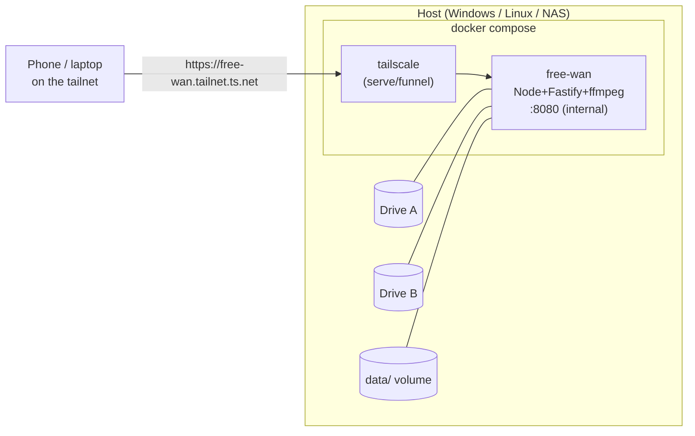

# 12 — Deployment

One `docker compose up` brings up Free-WAN plus a Tailscale sidecar that publishes it over
HTTPS to the owner's tailnet — no port forwarding, no public exposure unless explicitly
chosen. Cross-platform (Windows, Linux, NAS) per NFR-04.

## 1. Topology



The app listens only on the internal Docker network; the Tailscale container terminates
TLS and proxies to it. Nothing binds to a public host port by default.

## 2. Image (`Dockerfile`)

Multi-stage: build the web app and API, then a slim runtime with **ffmpeg bundled**.

```dockerfile
# --- build web + api ---
FROM node:20-bookworm-slim AS build
WORKDIR /app
COPY package*.json ./
COPY packages ./packages
RUN npm ci && npm run build         # builds web (Vite) and api (tsc/bundle)

# --- runtime ---
FROM node:20-bookworm-slim
RUN apt-get update && apt-get install -y --no-install-recommends ffmpeg ca-certificates \
 && rm -rf /var/lib/apt/lists/*
WORKDIR /app
ENV NODE_ENV=production
COPY --from=build /app/packages/api/dist ./api
COPY --from=build /app/packages/web/dist ./web
COPY --from=build /app/node_modules ./node_modules
# run as non-root (least privilege; see 13-security.md)
USER node
EXPOSE 8080
CMD ["node", "api/index.js"]
```

> For **GPU transcoding** (FR-29), use a base/ffmpeg with the right support (NVENC needs
> the NVIDIA runtime + `deploy.resources.reservations.devices`; QSV/VAAPI need `/dev/dri`
> passed through). Ship a `Dockerfile.gpu` variant and document the compose overrides; the
> app falls back to software if HW init fails.

## 3. Compose (`docker-compose.yml`)

```yaml
services:
  free-wan:
    build: .
    container_name: free-wan
    restart: unless-stopped
    environment:
      - FW_ADMIN_USERNAME=${FW_ADMIN_USERNAME}
      - FW_ADMIN_PASSWORD=${FW_ADMIN_PASSWORD}   # bootstrap only; change in-app after
      - FW_SESSION_SECRET=${FW_SESSION_SECRET}
      - FW_CONFIG=/config/free-wan.yaml
    volumes:
      - ./config:/config:ro
      - free_wan_data:/data
      # --- one mount per drive/repository (read-only recommended) ---
      - "${DRIVE_A}:/media/drive-a:ro"
      - "${DRIVE_B}:/media/drive-b:ro"
      # a writable target for downloads/exports if commands write media:
      - "${DOWNLOADS}:/media/downloads"
    # ports: []  # intentionally none; Tailscale handles ingress
    networks: [fw]

  tailscale:
    image: tailscale/tailscale:latest
    container_name: free-wan-ts
    restart: unless-stopped
    hostname: free-wan
    environment:
      - TS_AUTHKEY=${TS_AUTHKEY}
      - TS_STATE_DIR=/var/lib/tailscale
      # Publish the app to the tailnet over HTTPS (private). For public, see §6.
      - TS_SERVE_CONFIG=/config/ts-serve.json
      - TS_EXTRA_ARGS=--ssh
    volumes:
      - ts_state:/var/lib/tailscale
      - ./config:/config:ro
    cap_add: [net_admin, sys_module]
    networks: [fw]

volumes:
  free_wan_data:
  ts_state:
networks:
  fw:
```

`config/ts-serve.json` maps the tailnet HTTPS endpoint to the app container:

```json
{ "TCP": { "443": { "HTTPS": true } },
  "Web": { "free-wan.<tailnet>.ts.net:443": {
    "Handlers": { "/": { "Proxy": "http://free-wan:8080" } } } } }
```

> Tailscale's Serve/Funnel CLI changed in client **1.52+**; if you drive it via CLI instead
> of `TS_SERVE_CONFIG`, the modern form is roughly `tailscale serve --bg 8080`. Serve =
> private to your tailnet (recommended). Funnel = public internet (opt-in, §6).

## 4. Configuration

Precedence (low→high): defaults → `config/free-wan.yaml` → env vars → DB settings (admin
UI). See [`02-architecture.md`](02-architecture.md) §5.

`config/free-wan.example.yaml`:

```yaml
server:
  port: 8080
  trustProxy: true            # behind Tailscale
scan:
  watch: true
  schedule: "0 3 * * *"       # nightly full rescan backstop
  ignore: ["**/.*", "**/@eaDir/**", "**/*.part"]
  videoExt: [mp4, mkv, webm, mov, avi, m4v, ts, m2ts, wmv, flv, mpg, mpeg, ogv]
  imageExt: [jpg, jpeg, png, gif, webp, avif, heic, bmp, tiff]
transcode:
  hwaccel: auto               # auto|nvenc|qsv|vaapi|none
  cacheMaxGB: 20
  idleTimeoutS: 60
  segmentSeconds: 4
commands:
  enabled: true
  maxConcurrent: 2
  allowedExecutables: ["/usr/local/bin/yt-dlp", "/usr/bin/ffmpeg"]
  runAsUser: "node"
exports:
  dir: /media/downloads/free-wan-exports
```

`config/repositories.yaml` (seeds the DB on first run; thereafter manage in the admin UI):

```yaml
repositories:
  - name: "Movies (Drive A)"
    path: /media/drive-a
    type: video
    readOnly: true
  - name: "Photos (Drive B)"
    path: /media/drive-b
    type: image
    readOnly: true
  - name: "Downloads"
    path: /media/downloads
    type: mixed
    readOnly: false
```

`.env.example`:

```dotenv
# Bootstrap admin (first run only — change password in-app afterward)
FW_ADMIN_USERNAME=admin
FW_ADMIN_PASSWORD=change-me-now
# 32+ byte random secret for signing sessions
FW_SESSION_SECRET=
# Tailscale auth key (from the admin console; tag it, make it reusable/ephemeral as you like)
TS_AUTHKEY=
# Host paths to your drives (Windows: C:\Media\...  Linux/NAS: /mnt/...)
DRIVE_A=
DRIVE_B=
DOWNLOADS=
```

## 5. Multiple drives (FR-01–FR-05)

Each drive is an independent **bind mount** into `/media/<name>` and a corresponding
repository. To add a drive later: add a `volumes:` line, add a repository (UI or YAML),
`docker compose up -d`, and scan. A drive going offline marks its repository/items
`offline` (FR-03) without data loss; reconnecting + rescan restores them. Mount read-only
unless a repository must be written to by commands/exports.

> **Windows host paths:** use the drive form in `.env` (e.g. `DRIVE_A=D:\Media\Movies`).
> **NAS:** point at the share's local path (e.g. `/volume1/Movies`). Network shares
> (SMB/NFS) work but expect slower scans; keep `data/` on local disk.

## 6. Remote access with Tailscale

- **Private (default, recommended):** Tailscale **Serve** publishes
  `https://free-wan.<tailnet>.ts.net` reachable by **your devices on the tailnet** with an
  automatic, valid TLS cert. This satisfies "reach it anywhere" without exposing anything
  publicly.
- **Public (opt-in):** Tailscale **Funnel** exposes the same URL to the open internet.
  Only enable deliberately; Free-WAN's own auth still applies, but you're now internet-
  facing — keep strong credentials and consider Funnel only for specific shares.
- Install the OS Tailscale client on viewing devices (or share the node); open the
  MagicDNS URL. No router/port-forward changes.

## 7. First run

1. `cp .env.example .env` and fill admin creds, `FW_SESSION_SECRET` (e.g.
   `openssl rand -base64 48`), `TS_AUTHKEY`, and drive paths.
2. `cp config/free-wan.example.yaml config/free-wan.yaml`; edit `config/repositories.yaml`.
3. `docker compose up -d`.
4. Open the printed `https://free-wan.<tailnet>.ts.net`, log in as the bootstrap admin,
   **change the password**, confirm repositories, and run the first scan.

## 8. Backups, updates, health

- **Backup**: stop the app (or use SQLite online backup) and copy `data/free-wan.db` plus
  `data/branding/`. Thumbnails/HLS/exports are regenerable and need not be backed up
  (NFR-11).
- **Update (Docker)**: `docker compose pull && docker compose up -d`; migrations run on boot.
- **Update (in-app, bare-metal)**: build a package on a dev machine with `pnpm package`
  (→ `release/free-wan-<version>.zip`), then upload it in **System → Software updates**. It is
  applied and the server auto-restarts. This is **code-only and data-safe**: only the built
  artifacts (`api/dist`, `api/migrations`, `web/dist`) are swapped — `DATA_DIR` and env config are
  never touched, the previous code is backed up under `.fw-update/backups`, and a package that
  crash-loops on boot is rolled back automatically. Requires running via the supervisor
  (`pnpm start`, the default) so it can relaunch; `pnpm start:direct` is for process-manager
  deploys (Docker/pm2/systemd) that restart on exit. A package whose npm dependencies changed
  needs a full redeploy + `pnpm install` instead.
- **Health**: `GET /api/health` for liveness; the admin **System** panel shows ffmpeg
  version, drive status, cache sizes, and queue depth (FR-62). Logs are structured to
  stdout (`docker compose logs -f free-wan`).
- **Resource caps**: set `transcode.cacheMaxGB`/`exports` limits and optionally Docker
  `mem_limit`/`cpus` so a big library or busy transcode can't starve the host (NFR-12).
